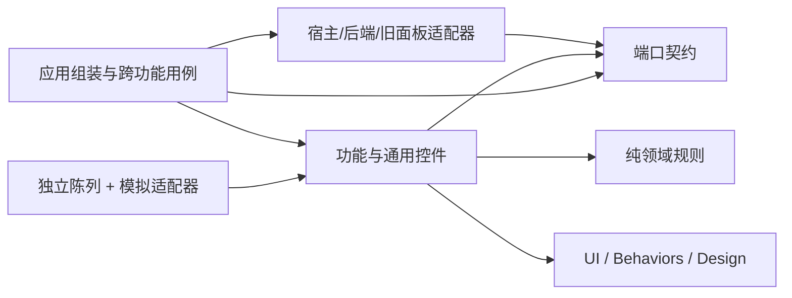

# 目标边界、数据归属与接口草案

> 范围以[本轮改造范围](../SCOPE.md)为准：仅现有创作画布及相关节点；展厅、徽章 App Mode 不调整。

以下为设计约束，不代表这些目录或接口已实现。采用同仓库独立前端源码和陈列入口；后续先验证构建/宿主兼容，再确定工具版本。Vue 可用于新控件，已有纯 JS 领域规则继续复用。

## 建议职责

| 模块 | 负责 | 禁止 |
| --- | --- | --- |
| design | 色彩、间距、字体、尺寸、层级、图标映射 | 节点判断、网络请求 |
| ui / behaviors | 按钮、弹层、媒体预览；焦点、键盘、拖动等通用行为 | 访问 ComfyUI 全局对象、导入业务功能 |
| contracts / domain | 数据类型、身份、校验与纯规则 | DOM、宿主、网络；无限扩张的公共工具箱 |
| features | 通用表格、Prompt、生成面板、素材等各自功能 | 导入另一功能的私有组件/状态；直接操作全局 graph |
| application | 表格→生成→结果回写等跨功能用例；上下文和控制器组装 | 绘制基础控件、保存登录凭据 |
| adapters | ComfyUI 生命周期、图与存储；ComfyTV 能力；DAELab 后端访问；旧面板兼容 | 成为绕过接口的第二套业务实现 |
| showcase | 用模拟服务陈列同一份真实控件源码 | 复制控件；启动时必须连接 ComfyUI |
| integration harness | 在真实宿主验证注册、工作流和插件兼容 | 被误当独立陈列的替代品 |

建议落点为 `frontend/src/` 下上述模块以及 `frontend/showcase/`，实际目录在第三阶段建立。Python 后端仍留在现有 `nodes/`，执行规则和任务账本不能迁到浏览器。



允许依赖方向由上表限定；图中适配器到契约表示实现接口。功能模块通过注入接口使用能力，不反向导入具体适配器。少量纯业务规则可以共享，不要求每个功能“零依赖”；要求没有隐式双向依赖。不要用无类型全局事件总线掩盖耦合。

## 共享组件与实例更新契约

目标是类似 Prefab 的“一处修改、多处生效”：陈列环境与产品入口导入同一份组件实现和设计变量。规范文档描述契约，组件源码实现契约；不得复制陈列代码形成各节点的独立版本。适用范围为已迁移到共享组件的 DAELab 界面，不承诺同步修改未迁移界面或只读 ComfyTV 上游。

- 共享内容：结构、视觉、通用交互、错误和禁用行为。每个组件有唯一实现入口与明确维护归属。
- 独立内容：各实例的素材、标题、参数、选择及任务身份。复用实现不得导致可变业务状态成为模块全局单例。
- 差异入口：通过有文档的参数、事件、插槽和组合实现；变体列入组件目录。禁止调用方依赖内部 DOM、复制实现或用私有 CSS 覆盖核心行为。确有例外时登记范围与退出条件。
- 更新生效：正式交付以构建并加载新资源为准；已有页面通常需要刷新。热更新只是开发便利，不是验收前提。构建和发布需处理资源版本/缓存，确认所有验收入口加载同一版本。
- 兼容性：修改样式和通用行为不覆盖实例数据。新增默认值只作用于未设置该值的实例；修改已保存数据必须有显式迁移与兼容读取。破坏参数/事件契约的变更必须列出消费方并同步迁移。
- 陈列中的参数编辑默认只改变示例实例，不自动回写组件源码或全局默认值；本计划不包含 Unity 式可视化 Apply/Revert 编辑器。

第二阶段为首批组件建立“唯一实现入口（拟定）→变体→消费入口→允许覆盖项→更新验收”的登记表；第三阶段用真实代码验证共享引用；第四阶段在真实宿主验证同步生效。登记表中的拟定入口不能标为已经接入。

## 数据归属

| 数据 | 权威拥有者 | 持久化/恢复策略 |
| --- | --- | --- |
| 节点、连接、原始参数 | 宿主图，经 HostAdapter 访问 | 迁移期间既有 widgets/工作流格式保持兼容，不另建平行可写图 |
| 表格内容、字段、素材绑定、编辑历史 | 每份文档一个 DocumentController | 当前内存表格和 widget JSON 同步将收敛为修改入口+序列化投影；历史在控制器，旧格式导出是投影 |
| 默认设置与每行覆盖 | 应用层 SettingsResolver | 定义覆盖优先级并形成不可变提交快照；后端再次校验，禁止两个面板相互持续回写 |
| 画布视口、卡片位置/折叠 | CanvasViewState | 保持 `graph.extra.daelabCreativeCanvasV1` 兼容；不修改原节点位置/大小来存卡片布局 |
| 选择、悬停、焦点、弹层 | 当前视图会话 | 临时数据；关闭/卸载时释放，不混入业务文档 |
| Prompt revision/epoch/请求序列 | 当前文档会话的异步保护器 | 单调变化，不进入撤销或工作流序列化；加载和销毁使旧回调失效 |
| 任务状态、请求指纹、媒体快照 | Python 任务账本 | 前端/node properties 是显示缓存；重开后核对账本，不因刷新重新生成 |
| 输出媒体与引用素材 | 资产记录与明确的引用关系 | 稳定 assetId 和来源，URL 只是访问地址；输入预览和执行输出分开 |
| 连接凭据 | 现有后端连接管理 | 不进入工作流、陈列 mock、前端文档或截图 |

身份必须分开：workflow、node、document、record、asset、project、request。不能用显示名称、行号或媒体 URL 代替稳定身份。宿主没有可持久工作流 ID 时，适配器应建立有边界的会话身份并记录加载 epoch，不能虚构其现有支持。

## 最小端口草案

下列 TypeScript 仅表达契约，第二至四阶段再按现有实现细化，并非新增 API 的承诺。

```ts
type Scope = { workflowSession: string; nodeId: string; epoch: number };
type Dispose = () => void;
type Revision = number;
interface DocumentPort<T, Command> {
  read(): { value: Readonly<T>; revision: Revision };
  dispatch(command: Command, expectedRevision: Revision): void;
  subscribe(listener: () => void): Dispose;
}
interface CardRenderer {
  mount(container: HTMLElement, scope: Scope): Dispose;
}
interface GenerationPort<Settings, Prepared, Job> {
  prepare(scope: Scope, settings: Readonly<Settings>): Promise<Prepared>;
  submit(scope: Scope, requestId: string, prepared: Prepared): Promise<Job>;
  resume(scope: Scope, requestId: string): Promise<Job>;
  stopPending(scope: Scope, requestId: string): Promise<void>;
}
```

实现要求：

- `Readonly` 不是深层不可变保证；适配器需返回不可变快照或防御性副本。
- 修改携带预期版本；冲突返回明确失败，不能悄悄覆盖。版本递增及撤销语义由 DocumentController 统一管理。
- 异步结果必须核对 scope、原记录、请求及版本；已切换工作流/删除节点/修改内容的响应不得直接写回当前视图。
- `prepare` 不提交付费生成，输出包含有效设置、来源身份和后端校验依据；提交时服务端仍需校验。
- `resume` 对原任务恢复；新生成显式使用新 requestId。同 ID 不同指纹必须拒绝。
- `stopPending` 只承诺停止尚未提交的批次项；不承诺取消已经提交的远端任务。远端取消要经能力探测后另行定义。
- mount/subscribe 必须可释放，包含事件、轮询、Observer、媒体和挂载节点。所有者不得同时挂载两份可写面板。
- 跨模块结果通过应用用例按 recordId/requestId 写回；GenerationPort 不接收表格 DOM 或调用表格私有方法。

## 宿主与构建边界

旧面板搬运、菜单 DOM 兼容、原生 widgets、App Mode 和图接线集中进入宿主/legacy 适配器。创作画布通过适配器读取既有功能状态；Graph/App Mode 保持现有展示与行为，不要求迁移到新组件。

新构建产物只能写入明确拥有的输出目录，不覆盖现有 `web/` 脚本。迁移单个功能时必须关闭对应旧入口，防止双重注册；先验证 ComfyUI 扩展加载机制与 Vue 运行时来源，再决定打包策略。控件样式限定作用域，不以全局 reset 改变 ComfyUI/ComfyTV。

ComfyTV 仅通过公开接口、注册节点和受控面板兼容访问；能力缺失时提供明确降级。任何需要改动上游代码的方案必须另行获得用户明确批准。
