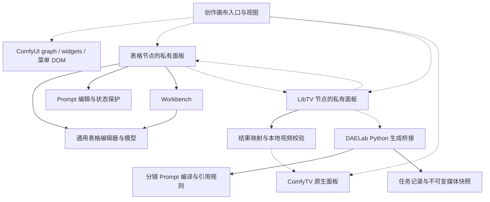

# 现状与依赖账本

> 范围以[本轮改造范围](../SCOPE.md)为准：仅现有创作画布及相关节点；展厅、徽章 App Mode 不调整。

本页源码路径相对于仓库根目录。证据采用文件和符号名定位，避免当前未提交修改导致行号失效。

## 当前工程形态

前端主要是 `web/` 下的 JavaScript 注册入口和 ES modules，使用原生 DOM；并非已经具备统一 Vue 组件工程。后端为 `nodes/` 下 Python 节点和 DAELab API。`WEB_DIRECTORY` 发布前端扩展。仓库根目录没有统一前端 package.json；不能直接假定存在可用的组件构建流水线。

已有复用基础：`data_table_model.mjs`、`data_table_editor.mjs`、`table_prompt_model.mjs`、`table_video_references.mjs`、`dynamic_widget_lifecycle.mjs`、`list_editor_controls.mjs`、共享 App Mode Bypass。后续优先提取和包裹这些实现。

## 当前关键依赖

实线表示模块导入/代码依赖；虚线表示运行时访问、调用或 DOM 接管。图只画主路径，不是完整静态依赖图。

## 源码证据与待解耦项

| ID | 现状证据 | 影响 | 目标责任及退出条件 |
| --- | --- | --- | --- |
| D01 | `web/creative_canvas.js`、`creative_canvas_view.mjs` 识别功能节点、接管 `__dataTablePanel` / `__libtvPanel` / `.comfytv-root` | 画布知道每个功能的内部 DOM；重建时有所有权竞争 | 画布只挂载注册的 CardRenderer；旧面板搬运集中在 LegacyPanelAdapter，并通过切换/销毁验收后逐项移除 |
| D02 | `web/data_table_nodes.mjs` 的 `videoNode` 查找/创建批量生成节点并接线；生成入口打开其面板 | 表格承担工作流编排 | 移交应用层“从表格生成”用例；表格只输出选择与内容快照 |
| D03 | `web/libtv_panel.js` 调用来源节点 `__syncPromptDefaults`；`libtv_batch_panel.mjs` 调用 `__storyboardResultUI` | 功能间以私有字段通信 | 改用明确的设置解析与结果写回端口，不能只把私有字段改名 |
| D04 | `web/table_workbench.mjs` 从 `data_table_editor.mjs` 导入 `tableDialog` / `tableButton` | 通用容器反向依赖具体编辑器 | 提取可独立运行的按钮/弹层，Workbench 不再导入表格功能 |
| D05 | `data_table_nodes.mjs` 的 `save` 同步 `__dataTable`、widgets、报告、Prompt 状态；`syncDefaults` 同步生成设置 | 多个可写副本，归属不清晰 | 单一文档控制器负责修改与历史；持久化与展示为投影；有效设置由应用层合成 |
| D06 | `creative_canvas.js` 依赖菜单 DOM 定位；创作画布与 `libtv_panel.js` 有周期同步 | 宿主升级和释放生命周期敏感 | 所有宿主访问进入适配器；订阅优先，必要轮询登记频率并在 dispose 停止；菜单提供兼容失败的降级入口 |
| D07 | `daelab_studio_theme.mjs`、`table_workbench_theme.mjs`、`creative_canvas.css` 分别定义样式 | 同类控件视觉/交互容易分化 | 第二阶段登记实际值再收敛设计变量，样式限定作用域；检查现有 SVG 来源与许可，新图标使用 Phosphor/Remix |
| D08 | `nodes/libtv_bridge/media_snapshot.py` 的 `recovery_context` 引用分镜 `prompt_compiler` | 通用生成恢复依赖具体分镜格式 | 后续抽取明确的已编译请求契约/共享领域规则；快照和任务账本继续由 Python 管理 |
| D09 | `libtv_canvas_result.mjs` 使用 `/comfytv/assets` 和注册的 `ComfyTV.AssetVideoLoaderStage` | 依赖外部插件能力与接口版本 | 独立 ComfyTV 适配器做能力探测；缺失时保留本地结果、明确不可用，不静默丢失结果 |

这些是结构性风险和迁移工作项，不等于已经复现的数据损坏。尤其异步跨工作流回写需要专门测试，不能仅凭代码搜索宣称已经安全或已经出错。

## 现有接口与身份

- 表格/Prompt：`data_table_nodes.mjs` 使用 `/upload/image`、`/daelab/storyboard/import_document?preview=1`、`/daelab/storyboard/parse-prompts`；Prompt API 位于 `nodes/daelab_comfytv_storyboard/prompt_api.py`。
- LibTV 连接：`nodes/libtv_bridge/connection_api.py` 注册 `/daelab/libtv/connection/{action}`；登录/状态/项目/能力与生成提交是不同操作。
- 批处理：`batch_node.py` 发送 `daelab.libtv.batch`；前端按项目/请求身份消费事件。后续需补工作流上下文和卸载后的过期处理，不把显示进度当最终权威状态。
- `runtime.py` 的 `request_identity` / `preflight` / `generate` 维护请求身份与恢复；`batch.py` 从稳定行身份派生行请求；`media_snapshot.py` 固化媒体。
- `table_prompt_model.mjs` 的 `PromptRequests` 明确将单调 revision/epoch 排除在序列化和撤销快照之外。迁移必须保留这个性质。

## 不应误判为需要重写的部分

通用表格与分镜共用编辑器是正确方向；分镜应继续作为配置与业务规则。结构化 Prompt 引用、稳定素材 ID、任务指纹、媒体快照和恢复保护都是已有资产。当前 DOM 搬运可作为迁移期兼容措施，但必须有明确所有者和退出条件。
