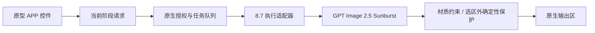

# Badge 8.7 Stage Execution

节点 ID：`DAELAB.BadgeApp87V1`。分类：`DAELab/Badge/App`。

配套工作流为 `user/default/workflows/#8.7 - Badge Workflow.json`。它复制 #8.6 APP Mode Prototype 的控件和布局，增加独立的阶段执行适配器。已有 #8.6 生成工作流和原型 JSON 不变。通过 `daelabBadgeExecutionV1.version=1` 启用真实执行；没有此标记的原型继续使用原来的模拟流程。

## 使用

#8.7 的选区方式、修改方式及取色来源使用一体式双项胶囊：浅色共同底座、深色选中项、图标加原有文字。复用现有按钮、互斥回调与状态属性；不改变生成逻辑。此样式不应用到 #8.6 原型。

“待编辑目标图”顶部同样提供“使用生成结果 / 已有效果图”来源胶囊，默认使用生成结果。两种图片分别保存：选择生成结果时使用当前选中的效果图；选择已有效果图时可上传或从图库选择，新生成不会覆盖当前手动目标。切换来源会同步预览和实际编辑输入，并使旧选区预览失效；没有生成结果时显示明确空状态。

重启 ComfyUI 加载新节点，打开 #8.7，进入 APP Mode，使用原有的“效果图生成”和“局部修改”页签。模型任务使用 ComfyUI 已登录账户；测试默认 Low、1:1、1024×1024、1 张。

两个页签的“模型输出配置”均支持 1–8 张生成数量，与本机 `OpenAIGPTImageNodeV2` 的 `n` 范围一致，默认 1 张，分别保存。基础调用直接传递 `n`；局部保护和区域材质逐张处理，再合并为完整输出批次。“生成结果”保留整批图片，首次默认采用第一张；局部目标图上方的缩略图条支持单选，显示当前编辑序号与勾选状态。窄窗口可横向滚动；只有一张时隐藏选择条。全部图片仍保留在原生输出区。选择数量不改变底部的运行次数。

再次生成时保留正在编辑的目标，显示“有 N 张新效果图 · 查看并选择”；查看不会改变目标，点击候选图后才切换。上一批的当前目标保留为候选。每张图独立保存 Polygon、画笔、颜色配置及对应分区图引用，切回时恢复草稿；首次编辑另一张图时清空手绘选区、重置颜色配置。切图使旧遮罩预览和服务端校验令牌失效，继续沿用自动校验后生成的流程。来源和选图随工作流保存，并在页签往返中保留；编辑执行期间禁止切换目标。不提供完整历史批次图库。

张数输入框与 1K、2K 分辨率按钮共用一行，不再单列生成个数区域或八个快捷按钮。支持悬浮后按住鼠标左键左右拖动和直接输入。底部原生“运行次数”也支持左右拖动。生成数量不会超出 1–8 张，运行期间禁用修改。

- 效果图生成：可仅填写基础提示词；上传平面图后可启用背景剔除、材质分区和高度建立。关闭的功能不形成输入依赖。
- 高度建立：支持原型的 2–6 个实体层、层透明度和未匹配颜色回落层；按前端规则量化灰度，通过第二参考图传给模型。
- 材质分区：复用材质目录及提示词，按源图颜色生成选区，与平面图使用相同的 contain 变换后直接传给 GPT 的 mask 输入，不执行配准或边界吸附。区域材质依次生成，复用 `BadgeMaterialConstraintV1` 保色/材质固有色策略，以处理后的平面图为保色参考；约束及最终确定性合成均使用同一份遮罩。基础效果图若改变图形位置，不再自动补偿。
- 局部修改：使用独立参考图；原图或 Color ID Map 取色，以及 Polygon/画笔均复用原型操作。预览遮罩是可选检查；点击生成会自动校验当前遮罩，再继续应用修改。服务端复核当前源图和选区，才执行语义修改或材质转换；选区外像素严格保留。
- 输出图和任务记录进入 ComfyUI 原生输出区。效果图生成成功后更新生成候选批次；首次生成可自动设为局部目标，后续批次由用户选择后切换，无需下载后重新上传。选择“已有效果图”时保留手动目标，局部生成结果也不会自动覆盖当前目标图。

原型实际展示的两个页签保持不变；保留的棚拍节点没有新增可见入口。适配器的 `studio` 支持单独集成测试，不代表增加了棚拍界面。

## 接口与复用

局部预设材质使用通用遮罩编辑提示词，不写入具体物体名称或固定底色。复用材质目录的语义、应用和避免项；可选 `surface_semantic` 专门描述保色模式下的表面响应。当前亚金与亚银使用材质目录中的本色；其他预设默认保留源图底色。策略由 material_execution.json 配置。语义描述页签仍与预设材质互斥。

局部材质调用共享 `BadgeMaterialConstraintV1` 的可选 `preserve_optics=True` 路径，保留候选图的宽高光及明暗分布，限制 OKLab 色度偏移，并精确保留遮罩外像素。不再把旧表面纹理全部当作结构边缘冻结，也不以程序纹理替代未生效的模型编辑。该图像空间校正是底色观感的近似约束，不是物理反照率分解；透明、折射、文字及轮廓仍需实际成片检查。旧工作流和生成阶段的区域材质保留默认处理路径。

阶段报告包含 `effective_prompt` 和 `material_processing`，可从任务历史核对实际提交的局部编辑提示词。共享节点的报告包含变化比例；该比例不代表材质语义已经通过视觉验收。

输入 `request_json`（STRING）由 #8.7 前端编译，包含阶段、稳定图片引用、当前有效选区/材质/高度配置和输出尺寸；节点输出 IMAGE 和 STRING 报告。局部修改的 `apply` 必须携带同一服务端会话最近预览得到的 `preview_token`。改变图片内容、选区、提示词、尺寸或服务端重启后，下一次点击生成会自动重新校验，无需用户手动预览。

旧辅助节点 `DAELAB.BadgeApp87RegionAlignV1` 保留注册与原行为以兼容已有工作流，当前 #8.7 生成入口不再调用。当前 refined 8.7 材质选区的前端预览使用服务端统一范围，执行仍先校验后生成；共享 Bypass 行为保持不变。画笔底图自动跟随编辑目标；加载未完成时执行入口提示等待，Load Image 保留为手动重试。

图片与遮罩使用相同的居中 contain 变换，避免拉伸。颜色选区在源图空间计算；Color ID Map 复用 #8.6 的 `DAELAB.BadgeColorIdMapV1`、默认提示词及文件缓存，由 GPT-Image-2.5 Sunburst 生成（1024×1024、单张、默认 Low）。非方形输入先 contain，生成后裁掉补边并按最近邻还原源尺寸。前后端使用同一张保存的 GPT 分区图取色，不再进行 85 步长 RGB 简化。Polygon 和画笔复用 `DAELAB.BadgeSelectionMaskV1`，通过 V3 `PREPARE_CLASS_CLONE` 获得独立执行上下文，不改写已有节点类。低于 16 像素的局部选区在模型调用前拒绝。

前端复用 `badge_build_prototype.js`、`badge_generation_panel.mjs`、`stageSnapshot`、Hierarchy、共享 Bypass、参考图上传/取色/画笔控件。按后续交互需求为 #8.7 增加双项胶囊样式与目标来源选择，原型不启用这些扩展。通过原生 `app.queuePrompt` 复用登录刷新、任务登记和输出展示，编译请求携带原生节点标题元信息。提交期间的临时转换接口在成功或失败后恢复。



## 验证与复现

在节点库目录运行：

```powershell
python -m unittest discover -s tests -p 'test_*.py'
node --test tests/*.test.mjs
python tools/badge87_fixtures.py --input-directory '<ComfyUI>/input'
# 使用已经登录的 comfy-cli Python 环境；凭据仅在内存中转交给本地 ComfyUI。
python tools/badge87_e2e.py --url http://127.0.0.1:8001 --cases tests/badge87_cases.json --results '<测试目录>/results.json'
# 使用具备 ComfyUI 依赖的 Python 环境验证实际 PNG 和区域外像素。
python tools/badge87_verify_outputs.py --workspace '<ComfyUI>' --comfy-core '<ComfyUI核心目录>' --results '<测试目录>/results.json' --report '<测试目录>/pixel-report.json'
```

案例矩阵覆盖纯提示词、背景/高度/材质的全部 8 个开关组合，原图/Color ID Map 与语义/材质的组合，Polygon、画笔、非方形透明输入、亚金固有色与材质强度、棚拍，以及缺少图片、空遮罩、未经预览直接应用、预览后更改输入的失败保护。局部流程实际提交预览与应用两个任务，预览任务不调用模型。分区材质有基础生成和区域生成多个模型调用，每次调用均为 Low、1:1、1 张，最终输出 1 张。

纯提示词和全图生成依赖模型理解，真实成片不是对所有文字、几何和高度的数学保证；确定性像素保护针对局部修改的选区外，以及每次区域材质合成的选区外。真实测试结果与已检查的范围记录在 [验收记录](./VALIDATION.md)。

色彩分区图时序：进入局部修改页、切换“使用原图 / 使用色彩分区图”只改变取色来源，不提交 GPT 任务。已有分区图可只读恢复；无分区图时保留目标原图显示，并等待明确点击“生成色彩分区图”。成功后按钮变为“重新生成色彩分区图”。目标未加载完成或生成进行中时禁用按钮。

#8.7 的生成按钮自动执行“服务端遮罩校验 → 应用修改”，不依赖手动预览确认。底部重复运行入口在该工作流的 App Mode 中隐藏，退出后恢复。服务端空选区、输入变化及选区外像素保护仍生效。阶段外图片节点临时 Bypass，原模式在进入对应阶段时恢复；序列化保存原模式。共享分组 Bypass 控制器遵守该阶段范围。

## 2026-09-14 模型迁移

#8.7 默认使用 `gpt-image-2.5-sunburst`。“模型输出配置”标题后可选择 Sunburst、Flare 或 GPT-Image-2；效果图与局部修改分别保存选择。所选模型贯通该阶段的所有生成和颜色收尾调用，Color ID Map 使用局部修改所选模型。共享 Color ID Map 节点默认仍为 gpt-image-2；前后端缓存均区分模型，旧分区图需要重新生成。

## 2026-09-14 交互收尾（interaction_revision=2）

- 仅 #8.7 启用，#8.6 与带 `daelabBadgeLocalMaterialsV1` 标识的 #8.8 保留原行为；复用现有生成面板、高度面板、取色、置顶参考图及 App Mode Bypass 模块。
- 移除独立配色页签。旧 `paletteReference` 数据保留但不参与 #8.7 请求；默认参考由当前设计稿和当前背景／镂空剔除配置重建。纯提示词模式不读取图片。
- 首轮不再提交或执行材质分区，材质修改使用现有局部修改入口。旧分区配置保留以便回退。
- 高度默认四层（0/30/60/100%），最多六层（含顶底层）。顶层固定 100%，底层固定 0%，两端滑条禁用；仅中间层可调、可增删，新增值取相邻层中间值并沿用 10% 步进。最少可保留顶底两层。已有中间层数值和颜色保留，两端归一为固定值；超过六层提示整理并阻止生成，不自动合并颜色。#8.6/#8.8 沿用原规则。
- 局部修改继承实际目标图尺寸，隐藏尺寸编辑，保留模型和张数；目标尺寸加载失败或不符合接口要求时阻止生成。后端再次读取目标尺寸，避免旧请求尺寸导致拉伸。
- 调试预览切换收起，保留原图与遮罩切换、置顶取色和高度检查。预览校验任务只返回报告，不生成 SaveImage 节点，也不污染结果图库。
- 旧矩阵中的首轮材质组合用于兼容路径测试；新版验收重点为参考来源、六层上限与顶底固定、模型路由、尺寸继承及预览／应用两阶段输出。

上述后端变更需要重启 ComfyUI，前端模块导入已更新缓存版本。


## 局部材质区域补全与边缘处理（2026-09-17）

当前 refined 8.7 的多层材质以及 `interaction_revision=2` 单材质入口使用统一的区域定义：

- `region_geometry.py` 只读取图像、取样种子和通用参数。RGB 阈值仍负责种子；Lab 连续性、步进亮度/色度和累计路径成本限制新增像素，默认局部半径 12 个源图像素。其他层的种子不可穿越，竞争接近的像素保留未分配。远处已命中的同色种子仍保留，不能解释为只选择一个语义图案。
- 图像字节、种子归属、算法参数和版本决定范围缓存；材质名称、强度和重抽次数不参与。执行令牌仍包含完整生成请求。缓存有数量和字节上限。
- 每层定义包含实际二值范围、邻近上下文、内部及亚像素覆盖率。模型仍收到完整目标图作为参考，包含所派生的邻近上下文；本版没有单独裁剪模型输入或扩大可修改区域。
- Polygon/画笔使用原有栅格化结果，不自动扩展手动边界。闭合标签保留孔洞、细线及断开的部分；这不是语义分割，也不通过全局闭运算填补图案。
- `DAELAB.Badge87BoundaryCompositeV1` 使用分块 4 倍采样的有符号距离覆盖率，只处理内侧窄带。可靠的混色边缘用原图估计覆盖率，再用新材质内部与外侧颜色重建，避免直接羽化回旧材质。区域内部保持候选结果，最终仍通过二值 `BadgeDeterministicComposite` 保证范围外不变。细线缺少可靠内部样本时保守保留，不从远处借用颜色。
- `POST /daelab/badge87/region-geometry` 返回执行使用的标签图和范围指纹。复用原区域列表、置顶取色图、遮罩按钮及列表行预览；前端不再以颜色阈值近似最终材质范围。新增节点使用共享 App Mode Bypass 注册。
- 文字使用 `content/badge87/prompts/` 模板；生成策略使用 `content/badge87/material_execution.json`。当前亚金/亚银采用目录中的材质本色与不透明定位图，其他材质默认保色。材质生成策略不进入选区算法。

测试记录位于工作区 `output/badge87-region-boundary-20260917/`。真实 Sunburst 的烤漆、亚银、闪粉均完成，范围外像素误差为零；复杂细金线附近仍有部分旧青绿色残边，不能视为所有边缘已通过视觉验收。低分辨率、弱边界和不可可靠分离的混色像素需要手动修正或后续更强的分割方法。
