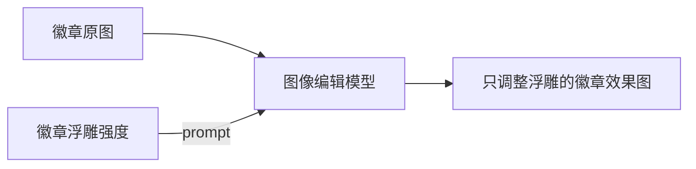

# 徽章浮雕强度 / Badge Relief

把 0–5 档的“表面浮雕立体程度”转换为适合图像编辑模型的严格提示词。节点只描述徽章表面沿 Z 轴的高度变化，并固定保护已有材质、文字、颜色、图形、构图和相机状态。

## 节点信息

- 节点 ID：`BadgeReliefPrompt`
- 显示名称：`徽章浮雕强度 / Badge Relief`
- 分类：`DAELab/OpenAI`
- 输入：`relief_level`
- 输出：`prompt`

## 浮雕档位

| 数值 | 名称 | 几何意图 |
| --- | --- | --- |
| `0` | 完全平面 | 消除图案区域之间的表面高差。 |
| `1` | 微浮雕 | 几乎不可察觉的微小 Z 轴高差。 |
| `2` | 浅浮雕 | 克制的浅浮雕和极小侧壁。 |
| `3` | 中浮雕 | 清晰但受控的高差、侧壁和倒角。 |
| `4` | 深浮雕 | 显著的高浮雕层级，同时锁定所有二维边界。 |
| `5` | 高浮雕 | 在仍可制造为徽章的前提下使用最强浮雕高度。 |

## 固定保护规则

节点输出的提示词始终要求：

- 材质身份、反射率、粗糙度、纹理和表面处理不变；
- 文字内容、字体、字形轮廓、字距、字号和位置不变；
- 原始色值、颜色边界、透明度和全局调色不变；
- 图形、线条、图标、比例、轮廓、布局和外形不变；
- 只允许已有区域沿徽章表面法线方向发生 Z 轴高度变化；
- 只允许因新几何产生的局部高光、自阴影和环境遮蔽发生变化。

该提示词不能提供像素级生成保证。对文字和细线必须绝对不变的工作流，仍建议在模型输出后重新覆盖原始二维设计层。

## 使用方法

1. 添加 `徽章浮雕强度 / Badge Relief` 节点。
2. 使用分段滑条选择 0–5 档浮雕强度。
3. 将 `prompt` 输出连接到 GPT Image 2 等图像编辑节点的提示词输入。
4. 把原始徽章图作为编辑图像输入，而不是重新进行纯文本生成。

## 应用构建模式

前端将原生整数输入替换为一个可拖动、可点击的 6 档分段滑条，并把它作为单一应用输入。该节点进入 Bypass、Mute 或其他非正常执行模式时，复用 `web/app_mode_bypass.js` 的共享逻辑自动隐藏应用面板输入；恢复 Active 后重新显示。

## 相关文件

- 后端：`node.py`
- 前端面板：`../../web/badge_relief_prompt.js`
- 面板纯逻辑：`../../web/badge_relief_prompt_panel.mjs`
- 后端测试：`../../tests/test_badge_relief_prompt.py`
- 前端测试：`../../tests/badge_relief_prompt_panel.test.mjs`
