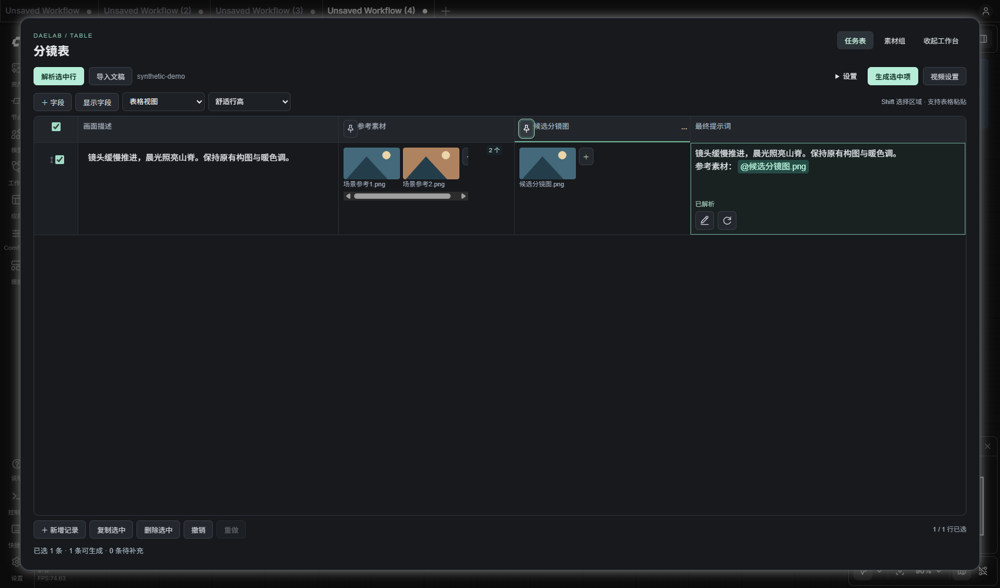

# 分镜表、Prompt 与视频参考：交付索引

整理日期：2026-09-27。该发布分支基于已有 LibTV 桥接分支，集中收录分镜、多维表格及相关共享依赖。原工作区的徽章功能历史不属于本次发布差异。

## 已实现

| 能力 | 入口与行为 |
| --- | --- |
| 文稿导入 | 预览表格候选、映射列、绑定图片；图片续行明确选择合并或独立保留，确认追加/替换后写入 |
| 原稿保留 | 原稿图片、原文字段、文稿说明与生成字段分别保存；旁白与对白不自动加入画面 Prompt |
| 通用表格 | 类型化字段、增删行列、单元格/图片拖动、复制粘贴、卡片视图、展开工作台与撤销重做 |
| 列交互 | 分隔线调整相邻列宽，ICON 交换相邻列；保留列头拖动排序，字段 ID 与数据不随位置变化 |
| 行与 Prompt | 勾选行批量解析、编辑结构化正文与引用、单行重新解析比较、复核、悬浮预览和失效提示 |
| 视频参考 | 列头图钉“标记参考”；仅已标记列参与，全部关闭不回退到隐式引用，取消不删除图片 |
| 批量提交 | 复用 LibTV CLI 桥接，全批次预检后串行执行；单行可覆盖模式和时长，失败可按原请求恢复 |
| 结果与恢复 | 素材快照、稳定任务身份、旧响应隔离、结果回填及重开后恢复可播放视频 |

复用 `createTableEditor`、`tableButton`、`SnapshotHistory`、字段映射、现有素材组和 LibTV 面板；App Mode 始终使用共享 bypass 实现。新增结构化 Prompt 编辑器、编译器和列分隔控制只承担原控件未覆盖的职责。未向 `custom_nodes/ComfyTV` 写入功能代码。

## 开始使用

1. 使用运行 ComfyUI 的 Python 安装仓库根目录 `requirements.txt`，重启 ComfyUI 并刷新前端。
2. 打开 [分镜模板](../../examples/libtv/Storyboard%20Studio.json)，或从 [通用空表](../../examples/table/Generic%20Table.json) 开始。分镜表提供默认字段映射，通用表先在“设置 → 字段映射”绑定正文。
3. 导入文稿并确认写入，或手工填表。点击图片列头图钉标记视频参考：绿色参与，灰色不参与。新建列与素材组默认关闭，旧工作流已有参考映射/素材组迁移为可见标记。
4. 配置生成方式后勾选行并解析，检查最终 Prompt 与引用；首尾帧顺序为最终素材列表前两张。源图/引用变更后先复核或重新解析。
5. 通过“生成选中项”连接 LibTV 批量节点并配置账号、画布和模型。相同批次编号用于恢复既有任务；修改内容再生成需新批次。模型能力与费用以提交时账户情况为准。

连接方式：

```text
DAELAB.Table.table_json ────────────────┐
                                       ├→ DAELAB.LibTV.StoryboardBatch.storyboard_json
DAELAB.StoryboardImport.storyboard_json ┘
```

这是两种可选上游；每个批量节点使用一个来源。单行是分镜记录，勾选行指定本次操作范围。

## 验证记录与复现

- 发布分支完整单元测试：Python 123 项、Node 153 项通过。Python 测试在 ComfyUI 自身 Python 环境运行，Node 使用支持内置 test runner 的版本。
- 原工作区的 4 个真实视频已完成正文、参考顺序、文件指纹、下载和实际播放验收。详见 [分阶段记录](PROMPT_PARSE_ACCEPTANCE.md)；发布整理不重复付费生成。
- 原工作区注册 68 个节点；该独立分支只包含 16 个注册节点。前端覆盖列表和运行时清单按当前分支核对，不能混用两者数量。
- 发布分支已完成表格、参考列、Prompt、分栏及合成 Word 导入的实际浏览器回归，页面错误均为 0；所有付费生成在浏览器边界被阻止或模拟，只有导入节点执行了免费队列。实际 V3 批量节点配合模拟 CLI 完成 2 行并验证再次执行零新增提交。公开截图仅使用合成素材。
- 汇总机器可读证据：[release-verification.json](docs/release-verification.json)。

```powershell
node --test "tests/*.test.mjs"
# 替换为运行 ComfyUI 的 Python
python -B -m unittest discover -s tests -p 'test_*.py'
```

浏览器脚本使用 Playwright 与本机 Chrome。执行前需启动隔离服务并准备本地素材；脚本参数见文件开头：

| 回归入口 | 覆盖 |
| --- | --- |
| `tools/data_table_smoke.cjs` | 两类表格、拖动、素材组、尺寸、刷新与 App Mode |
| `tools/prompt_parse_smoke.cjs` | 真实解析/复核接口、编辑、引用、重解析比较与模拟队列 |
| `tools/table_reference_smoke.cjs` | 列标记、失效阻断、实际解析结果、卡片、刷新与 App Mode |
| `tools/table_splitter_smoke.cjs` | 缩放拖动、交换、键盘、撤销与窄视图 |
| `tools/storyboard_multiref_smoke.cjs` | 文稿图片、多图分配与原稿保留；文稿清单由验收者提供 |
| `tools/libtv_saved_result_smoke.cjs` | 已完成工作流重开播放；需要先前生成结果，禁止新提交 |



## 尚未实现与验证边界

- “用解析文本和参考图更新分镜图”的统一操作、候选图片历史及采用版本仍是后续设计；既有 GPT Image 分镜节点不等于这套新流程已完成。
- 当前解析按规则组装，不调用 LLM 改写或理解图片。系统中文输入法体验仅覆盖浏览器 composition 事件，仍需人工体验。
- 真实视频验收不代表导演/美术质量、多机登录及实际断网恢复均通过；任务恢复另有模拟和快照测试。
- 参考快照属于本机私有缓存，目前不自动回收。文稿原图、账户画布、私有视频、请求编号及原始验收日志不包含在公开发布内容中。
