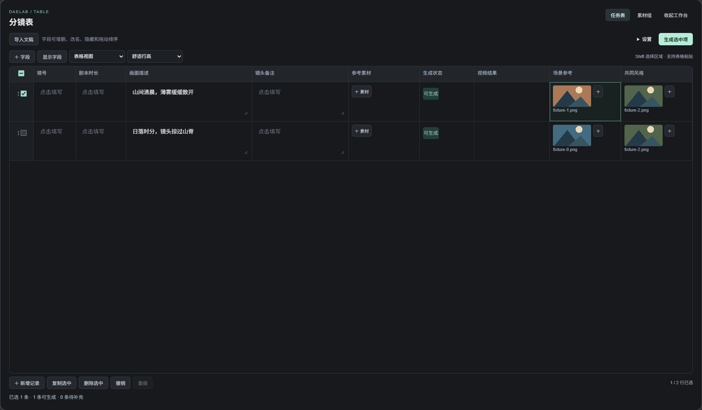
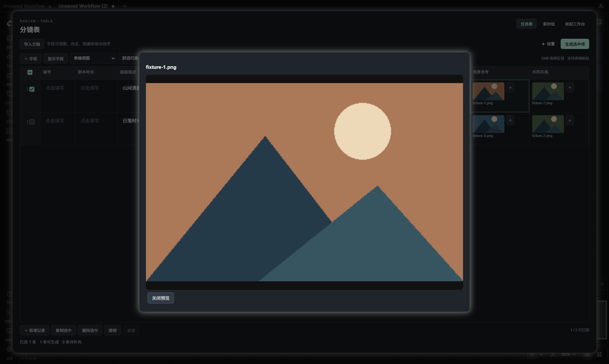

# 多维表格：通用底座与分镜模板

分镜表就是一张配置好字段的多维表格。Word 负责提供数据，LibTV 负责执行任务；表格的编辑方式只有一套。

## 怎么用

- **从空表开始**：添加 `DAELAB - 多维表格`，新增字段和记录，或打开 [空表模板](../../examples/table/Generic%20Table.json)。
- **从分镜开始**：添加 `DAELAB - 剧本分镜导入`，导入 Word，预览确认后追加或替换记录。
- **调整字段**：拖动两列之间的分隔线，一侧变宽、另一侧变窄；悬停显示交换图标，点击交换左右整列。表头的 `⋯` 仍可输入精确列宽、改名称和类型，或删除字段；拖动表头可跨多列排序。“显示字段”控制隐藏与显示。
- **编辑记录**：左侧勾选、拖动整行；单元格角落的拖动柄用于移动内容，目标已有内容时选择交换或替换。素材格可以容纳多张图片，单张拖动会移动到目标格。
- **批量编辑**：Shift 点击选区域，复制为表格文本；粘贴多行内容会按可见列填入并补行。格式不符合字段类型时整次粘贴取消。
- **整理素材**：两种表都有“素材组”。组对应普通素材字段，可逐行分配，也可每行共用。再次填入已有内容需要确认。
- **找回修改**：新增、删除、移动、字段设置和批量粘贴支持撤销、重做。编辑历史仅在当前打开期间保存。
- **切换视图**：默认表格；窄屏横向滚动。卡片视图由用户主动选择并随工作流保存。
- **展开编辑**：点击右上角“展开工作台”，在大窗口编辑同一张表。收起后保留修改和撤销历史，不另建副本；App Mode 也可使用。
- **查看素材**：点击缩略图打开大图或视频预览。行高可选“舒适”或“紧凑”，随工作流保存。

支持文本、多行文本、数字、勾选、单选、素材和结构化原文七种字段。字体统一声明为 Alibaba PuHuiTi 3；其他机器需安装该字体。

通用表格与分镜表使用相同的编辑器，以下旧版交互截图均为合成验收素材。最新列级标记截图见 DELIVERY.md。

## 分镜只增加什么

分镜模板预置镜号、剧本时长、画面描述、镜头备注、参考素材、原文来源、生成状态和视频结果。原文字段默认隐藏，可在“显示字段”中打开；旁白不会自动加入生成提示词。

“字段映射”按字段 ID 绑定含义。改列名、隐藏或换列不影响生成；删除绑定字段，或改成不兼容的类型后，需要重新映射。生成状态和视频结果为来源更新字段。

点击“生成选中项”，先检查画面描述和素材组是否齐全，再打开原有 LibTV 生成设置。首次使用会自动连接批量节点；“返回表格”继续编辑。返回结果按记录 ID 写回，所以拖动换行不会错位。素材顺序为参考素材字段中的图片，再按从左到右的素材组字段排列。

“设置”收纳字段映射和单独输出任务。状态列显示待补充、可生成、等待生成、生成中、已完成和需恢复；底部汇总选中记录。“定位问题”跳到缺项单元格。已生成后再修改提示词或参考素材，会提示“内容已修改”，重新生成前需在视频设置中新建批次编号。模型、参数、账号和网络仍由原有生成流程检查。






## 给后续开发者

```text
通用字段 / 记录 / 视图
        │
        ├── data_table_model.mjs：编辑、移动、粘贴、历史
        ├── data_table_editor.mjs：唯一的表格交互组件
        └── data_table_groups.mjs：普通素材字段的批量填充
        │
分镜模板 + storyboard_table_adapter.mjs
        ├── DOCX 解析 → 预览确认 → 字段填入
        └── 字段映射 → LibTV 批量节点 → 记录 ID 回填
```

`data_table_nodes.mjs` 只负责 Comfy 节点生命周期、上传、模板入口和业务连接。复用既有导入预览、本地图片拖入、控件生命周期、App Mode 显隐，以及 LibTV 官方 CLI 转接。全部代码归 DAELab，ComfyTV 上游未改动。

分镜序列化升级为 schema 4：`table` 保存字段、记录、视图和模板元数据；`shots` 等旧格式字段作为兼容输出。后端始终从 `table` 重新生成任务，避免使用过时的兼容字段。旧工作流加载时转换，保留记录 ID、素材、选择状态和来源。新通用节点输出独立的 `table_json`。

## 已验证与当前边界

- 真实 ComfyUI：通用表、分镜表执行同一套字段与行列操作；刷新两次后数据与尺寸保持一致；App Mode 的 Active / Bypass / Muted 可恢复。新增节点已纳入共享机制，实际注册的 68 个节点与覆盖表一致。
- DOCX：取消不写入；多表选择、预览编辑、追加、替换、内嵌图片、上传失败保留原表；真实导入节点执行成功。
- LibTV：选中行序列化、素材组顺序、同格多参考图、结果按 ID 回填；模拟 CLI 验证中断恢复和重复执行不新增提交。本次没有真实付费生成。
- 图片上传支持 PNG / JPG / WebP。批量视频仍为每批 1–100 行、每行一个结果、串行执行。剧本时长仍保留原文；需要逐行控制时，用“设置 → 添加逐行生成设置”创建“生成秒数”和“生成方式”，留空沿用视频面板。
- 这一版未实现公式、关联表、筛选视图、协同编辑或通用文件附件。跨表拖动暂不支持。
- 本轮完成展示版 P0：展开工作台、精简操作层级、素材大预览和任务状态。素材侧栏、分配预览、冻结镜号、保存筛选留到后续。
- 新增真实界面验证：两类表展开编辑后收起并撤销；首次创建 LibTV 节点后打开设置；缺项拦截；媒体大预览；修改内容提示；展开期间切换 Bypass 自动收起。视频预览使用本地合成片段，提交请求已拦截，没有付费生成。

复验入口：`tests/data_table.test.mjs`、`tests/test_data_table.py`；真实界面使用 `tools/data_table_smoke.cjs <输出目录> <合成图片目录>`，连接隔离测试服务 8199。导入与 LibTV 回归分别使用现有 `storyboard_import_smoke.cjs`、`storyboard_batch_smoke.cjs`。

### 列分隔线与相邻列交换

两种表格、展开工作台和 App Mode 共用 `table_column_splitters.mjs`，通过原编辑器的 `change` / `SnapshotHistory` 保存列宽与排序。一段拖动只记一次撤销；Esc 取消尚未提交的拖动，焦点在分隔线上时左右方向键微调（Shift 加大步长）。每列沿用 100–600 的宽度范围，保存后重开保持。

分隔线覆盖表格可见高度，随横向滚动定位；左侧选择栏不参与交换。交换可见相邻列时，隐藏字段原位置不变，字段的宽度与内容一起移动，记录值及字段 ID 映射不变。素材组列的顺序仍会影响参考素材编译顺序，已解析任务按现有机制要求复核。卡片视图不显示列分隔线。

回归入口：`tests/table_column_splitters.test.mjs` 与 `tools/table_splitter_smoke.cjs <服务 URL> <表格 JSON> <证据目录>`；覆盖缩放拖动、取消、键盘微调、整列交换、撤销重做、工作台、两次刷新与 App Mode Bypass/Muted 恢复。原表头排序、素材移动、复制粘贴继续由 `data_table_smoke.cjs` 验证。

## 视频参考列标记

- 图片列表列头提供图钉 ICON“标记参考”：绿色图钉及列头底线表示参与，灰色表示不参与。开关作用于整列；卡片视图和“显示字段”窗口也可切换，支持撤销/重做并保存到工作流。
- 通用表格和分镜表使用同一控制。新建图片列、素材组默认不标记；既有工作流的参考素材映射列及素材组迁移为显式已标记，其他列默认关闭。新分镜表的“参考素材”列保持已标记。
- 取消标记只改变视频用途，不删除图片，不修改原稿，也不改变现有图像生成节点的素材映射。已标记的主参考列在前，其余已标记列按表格顺序、格内图片顺序组装。隐藏字段不等于取消标记。
- `fields[].video_reference` 和 `meta.video_reference_version=1` 表达显式选择。全部关闭即无视频参考，不会回退到自动收集；必填检查只作用于已标记的组。具体生成模式仍会校验所需图片数量。
- 最终 Prompt 的素材选择器仅提供已标记列；取消旧引用所在列会使旧结果失效，必须重新解析或移除引用后复核。解析、普通批量提交、复核提交和恢复任务均以当前标记重新检查，避免旧引用继续上传。
- 本机实测：两类表格切换图钉、重新解析仅保留指定列、原图片不变、撤销、卡片视图、两次刷新、App Mode Active/Bypass/Muted 均通过。未发起付费生成。
- 回归入口：`tests/table_video_references.test.mjs`、`tests/test_prompt_compiler.py`、`tests/test_data_table.py`；界面脚本 `tools/table_reference_smoke.cjs <服务 URL> <表格 JSON> <证据目录>`。

## 真实 Word 多图导入

- 自动识别“描述”“设计描述”；与“画面”图片列并存时优先读取文字描述。“3.8米”不再误识别为编号分镜。
- 导入预览每行横向展示全部图片，标明来源列；支持前移、后移、多图补充和逐张取消“用于生成”。
- “原稿图片”保留全部上传图片，“参考素材”仅保留选中的有序图片列表。两者使用同一种素材字段；原稿列只读，普通参考列可编辑。不同分镜允许不同图数。
- 只有图片的行必须选择“独立保留，稍后补描述”或“并入上一条分镜”。合并保留来源行号和原文字段；不会自动判断叙事归属。
- 表外说明可在预览中查看，导入后在“设置 → 查看文稿说明”查看，不自动加入提示词。
- 素材组默认必填，可改为可选；可选组允许空行，逐行分配不足时余下行留空，不复制凑数。
- “设置 → 添加逐行生成设置”创建两个普通字段。可单独填写秒数和文生视频、首帧、首尾帧、多图或全能参考；留空沿用批量视频面板。模型仍为整批共享。首尾帧按最终参考列表顺序：第一张首帧，第二张尾帧。
- 每行图数、模式和时长仍受 LibTV 当前模型能力限制；所有行先检查，通过后才提交。超限报具体分镜，不静默截断图片。

三份真实文件已验证：808AI 21 条、10 个本地图引用；风四 24 条、73 张图片；长征主表 9 条、35 次图片引用（34 张独立图）。风四两条、长征一条图片续行需确认。测试中主动合并续行得到 22 / 8 条，并取消首图参与生成，确认原稿图片仍完整保留；这只是验收选择，不替用户决定最终分镜划分。两次刷新保持数据一致。

复验入口：`tools/storyboard_multiref_smoke.cjs <私有文件清单.json> <证据输出目录>`。真实文稿、截图和含素材的工作流不纳入代码仓库。808AI 的 `/view` 引用仍依赖本地图片文件，换机器需要同步图片。

### 多图行高修复

素材单元格统一采用有宽度约束的横向图片条，显示素材数量，图片数量不再撑高整行。点击缩略图仍使用原有大预览；拖动和撤销继续复用通用表格编辑器。修正位于编辑器自身，避免工作台样式被后加载的通用样式覆盖。

真实三份文稿的展开视图实测最大行高约 99 px；回归同时检查横向溢出、末图可预览、两次刷新及 App Mode 恢复。真实文稿截图保留在本机验收目录，不进入代码仓库。
