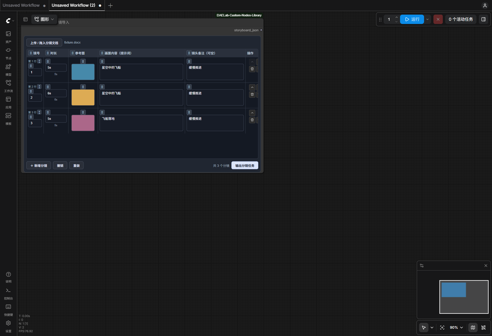
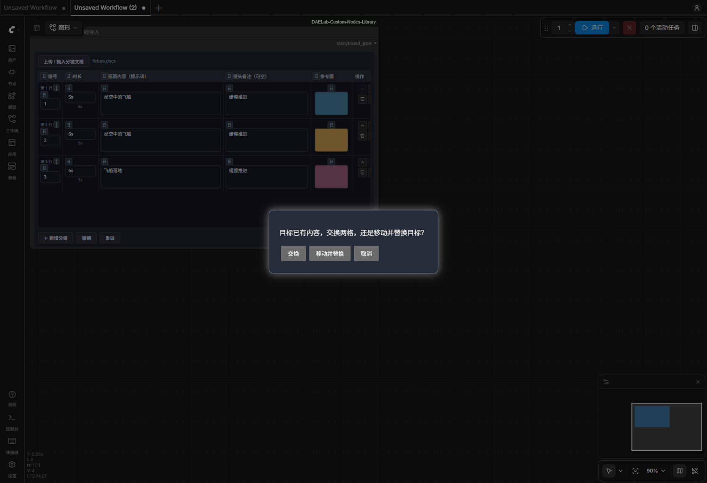
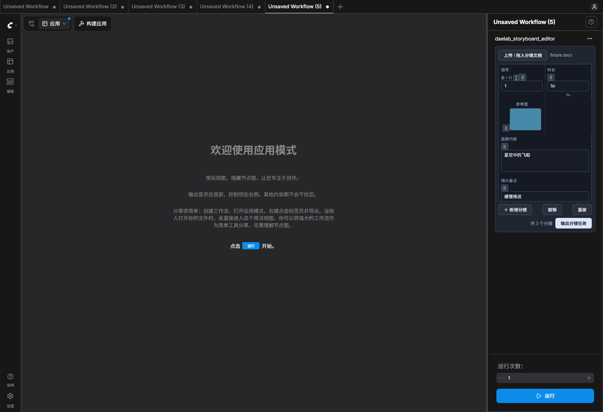

# 分镜表拖动编辑

确认导入后，直接在原分镜表里调整顺序和内容。`DAELAB - 剧本分镜导入` 与旧 GPT Image 2 StoryBoard 节点共用这套编辑器。

| 想做什么 | 怎么操作 |
|---|---|
| 调整整段分镜顺序 | 拖行号旁的 **↕**，放到目标行上半部或下半部；文字与参考图整行移动 |
| 移动单格内容 | 拖单元格旁的 **⠿** 到同类型格子；空目标直接移动，源格清空 |
| 调换两个元素 | 拖到已有内容的格子，在弹窗中选择 **交换** |
| 覆盖目标 | 选择 **移动并替换**；目标使用源内容，源格清空，可撤销 |
| 改变列的显示顺序 | 拖列标题旁的 **⠿** 到另一列前面 |
| 拖入图片 | 把本地图片文件或 ComfyUI 图片预览拖到参考图格；已有图时确认替换 |
| 拖入文字 | 把文字拖到文字格；已有内容时确认替换 |
| 撤销、重做 | 使用底部按钮，当前节点保留最近 60 步；连续编辑同一个文本框合并为一步 |

文字字段可相互拖动；图片只能进入参考图格。时长与镜号分别在同类字段之间移动。拖入 Word 等分镜文档仍会进入原导入预览。

显示的“第几行”随排序变化，原镜号和稳定分镜 ID 保留。生成结果仍可通过 `shot_id` 对应原分镜。拖动和编辑不会触发生图。

“输入已修改”表示这一行有手动编辑；它随工作流保存，不是生成队列状态。撤销恢复整份分镜数据，包含来源、原文、列顺序和修改标记。重新加载工作流后撤销历史清空，但编辑结果保留。

图片上传成功后才改变单元格。上传失败、上传途中撤销或删除分镜，都不会让迟到的上传结果覆盖当前内容；已上传文件可能留在本地 input 目录。

## App Mode

窄侧栏按分镜纵向显示，拖到滚动区上下边缘会自动滚动。底部保留撤销和重做。列标题拖动在节点画布表格中操作；App Mode 沿用保存的列顺序。

## 本轮范围与复用

本轮实现现有五列的拖动编辑，保留现有节点标识、输出接口和旧工作流。自定义新增列、素材组自动填列、公共引用列和批量任务调度仍属于后续扩展。

复用现有分镜数据模型、行操作按钮、动态控件生命周期、固定 520px 面板与共享 App Mode 控制器。从既有 Badge 图片拖入解析器提取通用本地图片解析入口，原 Badge 的 output/temp 限制保持不变。新增模块仅负责分镜拖动、冲突选择和节点内撤销。

## 验证记录

- 31 项 JavaScript 与 9 项 Python 测试通过。
- 在独立 ComfyUI 测试实例中，以合成 DOCX 实测原导入流程、原生整行拖拽、单元格交换/取消/替换、移入空格、列重排、文本撤销、图片 URI 与文件拖入、失败保护及上传期间撤销。
- 连续两次刷新后数据一致、面板只有一个；节点尺寸均为 920 × 558，90% 缩放下固定面板高度均为 468px。加载 5000px 高度的旧工作流后自动收回紧凑布局。
- App Mode 实测整行拖动、撤销及 Active / Bypass / Muted 隐藏恢复，无页面异常。
- 静态扫描器漏识别两个动态注册节点；通过实际 `/object_info` 核对，后端 66 个导出节点与共享注册表完全一致。
- 未调用收费生成，也未修改 ComfyTV 上游。

可复现脚本：`tools/storyboard_table_smoke.cjs`。详细结果：[table-verification.json](docs/table-verification.json)。
