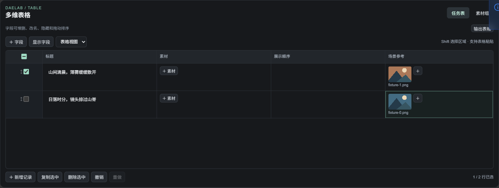

# 多维表格：通用底座与分镜模板

分镜表就是一张配置好字段的多维表格。Word 负责提供数据，LibTV 负责执行任务；表格的编辑方式只有一套。

## 怎么用

- **从空表开始**：添加 `DAELAB - 多维表格`，新增字段和记录，或打开 [空表模板](../../examples/table/Generic%20Table.json)。
- **从分镜开始**：添加 `DAELAB - 剧本分镜导入`，导入 Word，预览确认后追加或替换记录。
- **调整字段**：表头的 `⋯` 可改名称、类型和宽度，或删除字段；拖动表头换列。“显示字段”控制隐藏与显示。
- **编辑记录**：左侧勾选、拖动整行；单元格角落的拖动柄用于移动内容，目标已有内容时选择交换或替换。素材格可以容纳多张图片，单张拖动会移动到目标格。
- **批量编辑**：Shift 点击选区域，复制为表格文本；粘贴多行内容会按可见列填入并补行。格式不符合字段类型时整次粘贴取消。
- **整理素材**：两种表都有“素材组”。组对应普通素材字段，可逐行分配，也可每行共用。再次填入已有内容需要确认。
- **找回修改**：新增、删除、移动、字段设置和批量粘贴支持撤销、重做。编辑历史仅在当前打开期间保存。
- **切换视图**：默认表格；窄屏横向滚动。卡片视图由用户主动选择并随工作流保存。

支持文本、多行文本、数字、勾选、单选、素材和结构化原文七种字段。字体统一声明为 Alibaba PuHuiTi 3；其他机器需安装该字体。



## 分镜只增加什么

分镜模板预置镜号、剧本时长、画面描述、镜头备注、参考素材、原文来源、生成状态和视频结果。原文字段默认隐藏，可在“显示字段”中打开；旁白不会自动加入生成提示词。

“字段映射”按字段 ID 绑定含义。改列名、隐藏或换列不影响生成；删除绑定字段，或改成不兼容的类型后，需要重新映射。生成状态和视频结果为来源更新字段。

点击“视频生成 →”连接现有 LibTV 批量节点。选中的记录转换为生成任务，返回结果按记录 ID 写回，所以拖动换行不会错位。素材顺序为参考素材字段中的图片，再按从左到右的素材组字段排列。


## 给后续开发者

```text
通用字段 / 记录 / 视图
        │
        ├── data_table_model.mjs：编辑、移动、粘贴、历史
        ├── data_table_editor.mjs：唯一的表格交互组件
        └── data_table_groups.mjs：普通素材字段的批量填充
        │
分镜模板 + storyboard_table_adapter.mjs
        ├── DOCX 解析 → 预览确认 → 字段填入
        └── 字段映射 → LibTV 批量节点 → 记录 ID 回填
```

`data_table_nodes.mjs` 只负责 Comfy 节点生命周期、上传、模板入口和业务连接。复用既有导入预览、本地图片拖入、控件生命周期、App Mode 显隐，以及 LibTV 官方 CLI 转接。全部代码归 DAELab，ComfyTV 上游未改动。

分镜序列化升级为 schema 4：`table` 保存字段、记录、视图和模板元数据；`shots` 等旧格式字段作为兼容输出。后端始终从 `table` 重新生成任务，避免使用过时的兼容字段。旧工作流加载时转换，保留记录 ID、素材、选择状态和来源。新通用节点输出独立的 `table_json`。

## 已验证与当前边界

- 真实 ComfyUI：通用表、分镜表执行同一套字段与行列操作；刷新两次后数据与尺寸保持一致；App Mode 的 Active / Bypass / Muted 可恢复。新增节点已纳入共享机制，实际注册的 68 个节点与覆盖表一致。
- DOCX：取消不写入；多表选择、预览编辑、追加、替换、内嵌图片、上传失败保留原表；真实导入节点执行成功。
- LibTV：选中行序列化、素材组顺序、同格多参考图、结果按 ID 回填；模拟 CLI 验证中断恢复和重复执行不新增提交。本次没有真实付费生成。
- 图片上传支持 PNG / JPG / WebP。批量视频仍为每批 1–100 行、每行一个结果、串行执行。剧本时长暂不覆盖视频节点的统一生成时长。
- 这一版未实现公式、关联表、筛选视图、协同编辑或通用文件附件。跨表拖动暂不支持。

复验入口：`tests/data_table.test.mjs`、`tests/test_data_table.py`；真实界面使用 `tools/data_table_smoke.cjs <输出目录> <合成图片目录>`，连接隔离测试服务 8199。导入与 LibTV 回归分别使用现有 `storyboard_import_smoke.cjs`、`storyboard_batch_smoke.cjs`。
