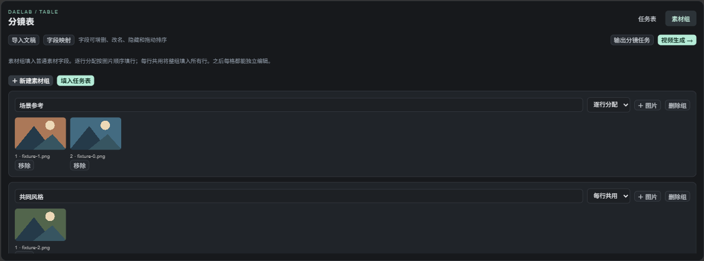
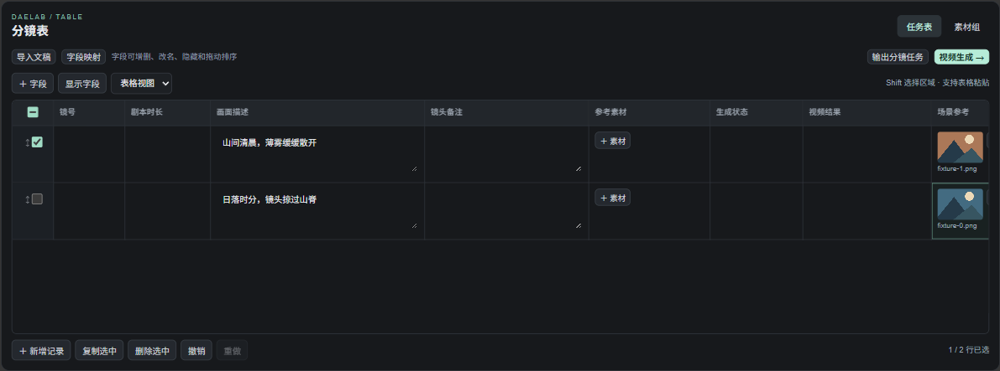

# 分镜工作台 · 素材编组与 LibTV 批量生成

先把素材和分镜放进一张表，再选行生成视频。视频全部通过现有 LibTV CLI 转接，使用 LibTV 账号积分。

分镜表现为通用多维表格的模板，字段和交互说明见 [多维表格](../daelab_comfytv_storyboard/TABLE.md)。

## 1. 整理素材

在“素材组”新建一组，上传多张图片，也可以拖入 Comfy 图片预览。组名就是任务表的列名。

| 分配方式 | 使用方法 |
|---|---|
| 逐行分配 | 第 1 张给第 1 行，第 2 张给第 2 行。组内拖动图片可以排序。 |
| 每行共用 | 整组图片用于每一行，适合共同角色、风格或场景。 |

点击“填入任务表”才会应用。已有分配会先确认，支持撤销；数量不匹配会提示，不会截断或循环填充。素材多于现有分镜时会新增空行，需要补全画面描述。

## 2. 检查任务表

导入 Word 分镜，或手动新增行。每行保留独立 ID；整行换位时，提示词、素材和结果对应关系一起移动。

素材组各占一列，同列的两个素材格可以拖动交换。修改组内容后需要再次“填入任务表”，不会偷偷改动已分配的行。

左侧独立选择列用于勾选和拖动整行；镜号、时长与正文从同一高度开始。拖动列标题调整列顺序；单元格拖动柄在悬停或键盘聚焦时显示。

勾选需要生成的行。提示词使用“画面内容＋镜头备注”，旁白和原始字段不会自动加入。参考图按“行参考图 → 从左到右的素材组 → 组内顺序”传给 LibTV；可以按这个顺序写 `@image_1`、`@image_2`。

## 3. 生成视频

重启 ComfyUI 后，导入 [Storyboard Studio.json](../../examples/libtv/Storyboard%20Studio.json)。也可在“剧本分镜导入”点击“视频生成 →”，自动连接批量节点。

1. 在视频面板登录 LibTV，检查连接，选择结果存放的画布。
2. 选择模型、输入模式、时长和分辨率。初版每行使用面板中的统一视频时长；分镜表的时长保留为剧本信息。
3. 点击“生成选中分镜”，确认行数后提交。所有选中行先检查，通过后才逐行生成。
4. 在视频面板查看每行进度、预览、下载，或加入 ComfyTV 画布。任务表也会显示对应行的最近状态。App Mode 使用标准视频预览展示结果。

原始 Comfy“运行”按钮同样会执行批量节点。生成新内容前先检查选中行与批次编号。

## 4. 失败与恢复

- 失败会暂停后续行，保留已完成结果。
- 原批次编号再次运行，用于恢复原任务；即使网络中断，也不会自动重复提交该行。
- 已提交内容发生变化时，原编号会拒绝执行。确实需要重新生成时，点击“新建批次编号”；选中行会作为新任务计费。
- 停止队列会在行与行之间检查取消；已提交到 LibTV 的远程任务不会因此撤销。

## 初版边界

支持 PNG/JPG/WebP 图片组；每批最多 100 行，每行一个视频，串行执行。暂未做视频/音频素材编组、多候选和并发调度。单视频节点原有视频/音频参考能力保留。

界面采用深灰底、简化表格线、统一按钮与薄荷色主操作，字体为 Alibaba PuHuiTi 3；未安装该字体的机器使用系统后备字体。

## 实现与验收

- 复用原分镜导入、表格拖动、撤销、图片上传、固定高度和共享 App Mode 显隐机制。
- 复用 `libtv_panel.js` 的连接、模型能力和设置控件；批量节点复用 `LibTVVideo` 的参数定义与本地素材校验，以及 `Bridge` 的官方 CLI、任务锁、去重、下载和恢复机制。没有修改 ComfyTV 上游仓库。
- 新节点：`DAELAB.LibTV.StoryboardBatch`。输入 `storyboard_json`；输出批次报告和视频 URL 列表。
- 任务记录位于当前 Comfy 用户目录的 `daelab/libtv/jobs`；视频位于输出目录的 `daelab/libtv`。保留任务记录才能可靠恢复。
- 浏览器验收覆盖图片排序、素材分配、单元格交换、勾选行、结果 ID 回填、两次刷新、超高节点恢复和两个面板的 Active/Bypass/Muted。未展开标准视频结果预览时，高度稳定在分镜节点 558、视频节点 758。
- 实际服务导出的 68 个 DAELab 节点与 App Mode 注册表、覆盖测试完全一致。以 `/object_info` 的运行时核对和真实界面验收为准。
- 真实 V3 节点配合模拟 CLI 验证两行返回视频、标准预览和再次执行零新增提交；另外测试中途失败后恢复不重复提交。浏览器生成请求在提交边界拦截，截图素材和结果事件均为合成验收数据。
- **本轮未进行付费 LibTV 生成，不代表已完成真实账号、网络和模型服务的端到端验收。**

复验：先启动隔离 ComfyUI 服务（端口 8199），然后用 `tests/storyboard_batch_fixture.py <图片目录>` 创建图片；运行 `tools/storyboard_batch_smoke.cjs <验收输出目录> <图片目录>`。需要 Playwright。`tools/libtv_batch_node_smoke.py <Comfy核心目录>` 使用真实节点与模拟 CLI，不访问 LibTV。
